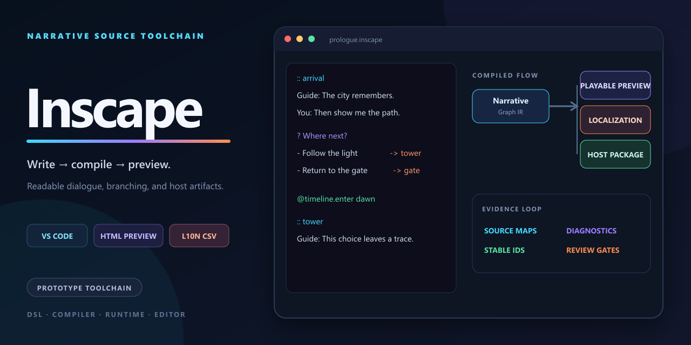

# Inscape

[简体中文](README.zh-CN.md)

A scripting language, editor, and lightweight toolchain for visual novels and branching narratives.



## What it includes

- Branching narrative scripting.
- Editor and self-hosted tooling.
- A tested multi-package codebase.

## Getting started

Restore and build with an installed .NET SDK:

```bash
dotnet restore
dotnet build
```

## Repository map

- `src/` — Application and library source.
- `tools/` — Development and content tools.
- `docs/` — Project documentation and design notes.
- `tests/` — Automated tests and validation fixtures.
- `samples/` — Runnable examples.

## Documentation

- [`docs/adr/0002-mark-uncertain-designs-as-draft.md`](docs/adr/0002-mark-uncertain-designs-as-draft.md)
- [`docs/architecture-evaluation-methodology.md`](docs/architecture-evaluation-methodology.md)
- [`docs/architecture-evaluation.md`](docs/architecture-evaluation.md)
- [`docs/architecture.md`](docs/architecture.md)
- [`CONTRIBUTING.md`](CONTRIBUTING.md)

## Status

Inscape is under active development and is not presented as commercially ready. The repository has a substantial implementation and test suite, but the language and editor contracts may still evolve.

## License

No open-source license is currently included in this repository.
