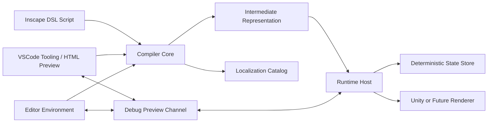

# 架构草案

状态：草案

## 总体结构

Inscape 采用三层解耦架构：

- Compiler Core：负责 DSL 解析、诊断、哈希锚点、IR 生成和本地化提取。
- DSL Tooling：第一阶段在 VSCode 中提供语法高亮、代码提示、诊断、跳转和 HTML 调试预览。
- Editor Environment：后续独立编辑器负责文本编辑、项目索引、逻辑可视化、状态检查和实时预览通信。
- Runtime Host：负责加载 IR、推进执行流、管理状态、调度渲染和素材系统。

当前实现处于第一阶段：Compiler Core、CLI、VSCode 轻工具和 HTML 预览已经可运行；Runtime Host 与独立 Editor Environment 仍处于设计和调研阶段。

## 核心约束

- 文本是主要源数据，配置应尽量作为文本标签或项目级资源索引出现。
- 编译结果应可序列化、可比较、可缓存。
- 第一阶段编译产物以纯数据 Narrative Graph IR 为主，不依赖 Unity ScriptableObject。
- 本地化提取和旧表更新属于 Compiler Core 能力，由 CLI 和未来编辑器复用。
- 运行时只消费 IR 与资源引用，不直接解析原始脚本。
- 状态变更通过 Action 或 Command 进入 Store，不允许任意系统直接改写叙事状态。
- 本地化、存档和热重载都必须能追溯到同一套锚点机制。
- 变量和状态查询只在 DSL 中表达，由宿主层根据 Schema 解析并绑定具体业务来源。

## 技术选型状态

### Compiler Core

- 开发语言：C#，目标为 .NET 8 与 Unity 兼容层。
- 解析器：Antlr4 与 Superpower 均为候选，需要通过 DSL 复杂度与错误恢复需求决定。
- 哈希算法：MurmurHash3 与 XXHash 为候选，需要比较跨平台实现、速度、碰撞概率和版本稳定性。

### Editor Environment

- VSCode 支持：第一阶段需要提供 TextMate 语法高亮和 Language Server 候选方案，至少覆盖语义高亮、补全、诊断、跳转定义、引用查找和节点图概览数据。
- HTML 调试预览：第一阶段后期需要提供类似 Inky 的轻量网页预览，用于无引擎调试节点、选项、跳转、回环和本地化锚点。
- 外壳：Tauri 候选，理由是轻量、跨平台、Rust 后端适合文件索引。
- 前端：React + Tailwind CSS 候选。
- 编辑器内核：Monaco Editor 候选。
- 通信：WebSocket 或 Socket.io 候选。是否需要 Socket.io 的协议能力待确认。

### Runtime Host

- 前期宿主：Unity。具体版本需确认，当前材料中“Unity 6”和“2023 LTS”存在版本表达不一致。
- 数据流：Command Pattern Pipeline 为优先候选；Entitas ECS 保留为复杂项目候选。
- 资产管理：Addressables 候选，用于立绘、背景、音频和视频加载。
- Bird 现有系统：当前 Unity 项目中 StorySystem 更接近对话图执行层，DirectorSystem 更接近带时间的演出队列。Inscape 第一阶段应优先编译到 StoryGraph IR，并保留映射到 StorySystem/Talking 数据的适配层；Timeline 先作为外部资源 hook 引用，manifest 可表达 phase，但除 `talking.exit` 外不直接生成 Bird effect。

## 编译数据流

1. 编辑器或命令行读取脚本文件。
2. Compiler Core 进行词法和语法分析。
3. 解析阶段生成诊断、AST 和可定位的源映射。
4. 语义阶段解析角色、标签、变量、分支与资源引用。
5. 锚点阶段为可持久化文本和节点生成哈希 ID。
6. 输出 IR、源映射、本地化提取表和诊断结果。

## 第一阶段工具链数据流

1. VSCode 扩展读取 `.inscape` 文件。
2. Language Server 调用 Compiler Core 做增量解析。
3. 返回语义 token、补全项、诊断、节点定义、引用和图结构摘要。
4. HTML Preview 读取同一份 IR，提供节点跳转、选项选择、回环检测和本地化锚点显示。
5. 预览不模拟 Unity 演出，只验证叙事图和文本体验。

## 运行数据流

1. Runtime Host 加载 IR。
2. 执行器按顺序读取 Command。
3. Command 发出状态 Action 或渲染请求。
4. Reducer 更新叙事 Store。
5. 渲染适配层根据 Command 与 Store 调用 Unity 资源和 UI。
6. 存档记录当前锚点、执行偏移、状态快照与必要的历史 Action。

## 需要尽早验证的架构问题

- 源映射是否能同时支撑错误提示、热重载、存档定位和本地化回查。
- 哈希锚点是否应该分为文本锚点、节点锚点和语义锚点。
- IR 是否需要保持人类可读，还是优先二进制体积和加载速度。
- Unity 插件和独立编辑器之间如何共享 Compiler Core。
- 扩展指令是编译期注册、运行时注册，还是两者都支持。
- Bird 的 Timeline 数据是否应该由 DSL 直接生成，还是保持为外部可引用演出资源。
